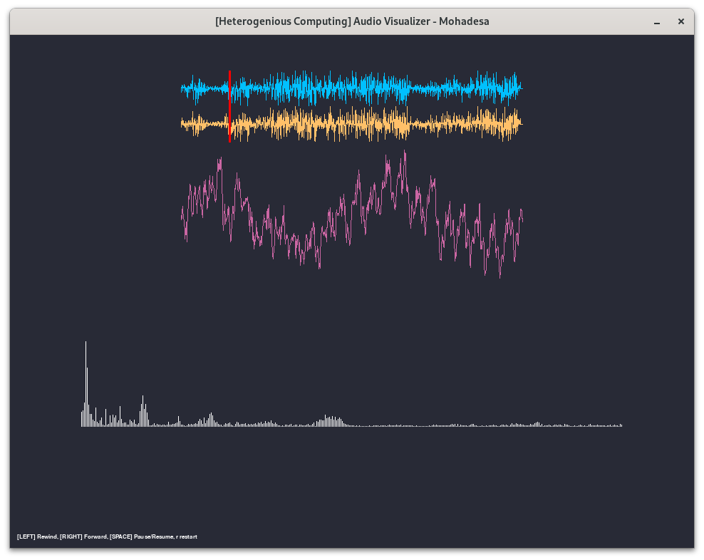
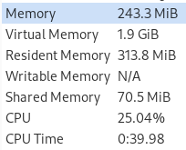
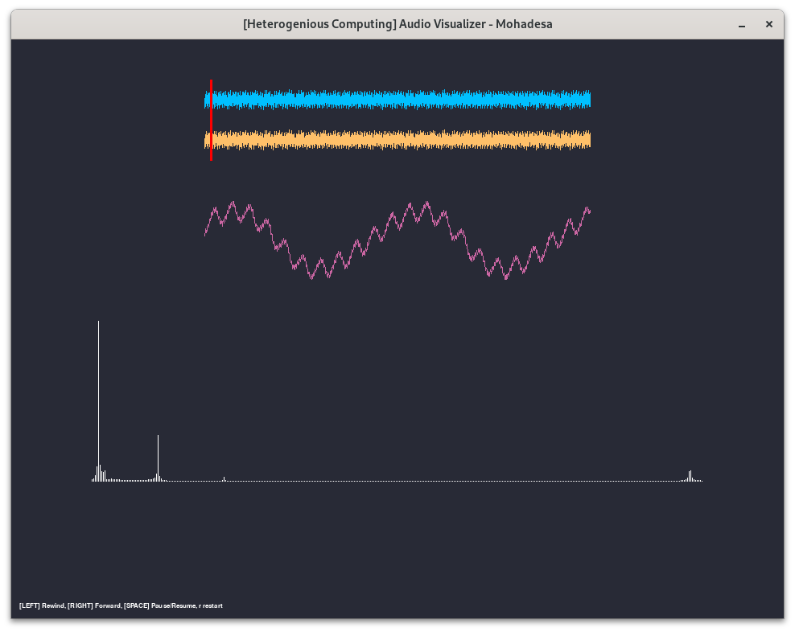
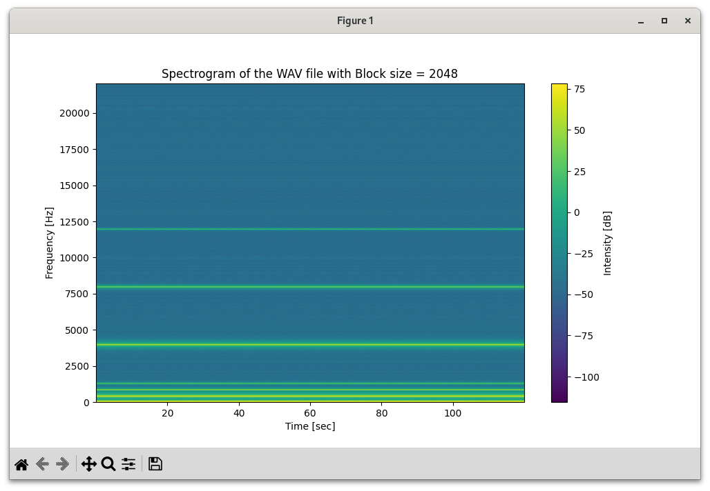

# HeterogeneousComputing01

## Installation

**Erstellen und aktivieren einer Virtuellen Umgebung**

- Unix
```bash
python -m venv venv
source venv/bin/activate
```

- Windows
```terminal
python -m venv venv
.\venv\Scripts\activate.bat
```


**Installieren der Dependencies**
```bash
pip install -r requirements.txt
```

### Aufgabe 1
```bash
python aufgabe1.py
```


Beim Ausführen von **Aufgabe1** öffnet sich ein Fenster, das die ausgewählte Wave-Datei abspielt und in Echtzeit visualisiert. Das Fenster für die FFT wird nicht immer um n=1 Samples verschoben, sondern es wird die Position aus dem Music-Buffer gelesen (*pygame.mixer.music.get_pos()*) und von dort aus die FFT berechnet, basierend auf einer anfangs definierten Größe, z.B. *FFT_SIZE = 1024*. Je größer die FFT_SIZE ist, desto mehr Frequenzbereiche erhält man und desto genauer ist die Visualisierung.
Ist die FFT_SIZE beispielweise 512, so erhält man *(512/2)-1 = 255* Frequenzbereiche. So umfasst jeder Frequenzbereich *44.100/255=172.94 Hz*.

Wie in der Abbildung zu sehen ist, werden drei Visualisierungen dargestellt.Einmal die komplette Wave-Datei, wie man sie z.B. aus *Audacity* kennt.Die mittlere Darstellung sind die Rohdaten der aktuellen Sinuskurve der Wave-Datei und die dritte die FFT-Darstellung. Allerdings hier eingeschränkt durch die Breite des Fensters, da ich keine Interpolation über die Daten laufen lassen wollte und die Originalwerte darstellen wollte.

Verwendete Bibliotheken: ***pygame, scipy***



**Speicherbedarf**
Da immer nur die aktuellen Werte berechnet und angezeigt werden, so liegt der Speicherbedarf bei der Größe der FFT_SIZE + Wavedatei + Pygame ( Fenster und Buffer ). Die FFT_SIZE hat hier eine eher geringere Rolle, da es keinen enormen Unterschied macht ob ein array von 1024 im Ram oder 1024*6 im Ram liegen. Bei Aufgabe2 wird genauer auf den Speicherbedarf eingegangen. Dort hat die FFT_SIZE eine auswirkung, da dort die ganze Wave-Datei analysiert und angezeigt wird. Auch das verschieben um n samples spielt dort eine Rolle, da dort der Speicherbedarf weit in die GB springen. Aufgabe 1 habe ich nur zum visualisieren genutzt.



Hier die Geheimnisvolle Wellenlänge. Zu sehen sind Sinuskurven in Sinuskurven. In der FFT sieht man welceh Frequenzen abgespielt werden um diese Kurven zu erhalten.


**Aufgabe 2**
```bash
python aufgabe2.py
```



In aufgabe 2, habe ich wie die meisten meiner Kommilitonen die matplotlib Bibliothek benutzt. Der Unterschied zu *Aufgabe1* ist, dass nun die ganze Wave-Datei visualisiert wird. Dadurch wirkt sich sowohl die FFT-Größe als auch das verschieben um n samples drastisch auf den Speicherplatz aus.

``` python
    spectrogram(data, fs=sample_rate, window='hann', nperseg=block_size, noverlap=block_size//8, scaling='spectrum')
```

Diese Funktion hat zwei für unseren Fall interessante Parameter. Einmal *nperseg* und einmal *noverlap*. 

*nperseg* gibt an ,wie groß die FFT ist. Beispielweise 1024.  
*noverlap* gibt an wieviele Werte sich überschneiden. Beispielsweise 1024/8 = 128.

Die Datei "nicht-zu-laut-abspielen" ist 21168044 byte groß.  
Hat man ein FFT_SIZE von 1024 So benötigt *data* folgenden Speicherbedarf :  
((FFT_SIZE/2)-1) * (RAW_FILE/(FFT_SIZE - OVERLAP)) * (2x8 Byte) = ((1024/2)-1) * (21168044/896) * 16 = 193,1584015 mb

Bei einem Overlap von FFT_SIZE-1, also wenn das Sample immer nur um 1 Verschoben wird erhält man 173,069927744 Gb.  

In meiner ersten Versuchsreihe hatte ich immer als wert von *noverlap* die FFT_SIZE durch einen konstanten Faktor geteilt, wodurch sich der RAM nicht erhöht, da dieser sich in der Gleichung so ziemlich Rauskürzt oder zu einer konstanten wird. Jedoch habe ich da schon verschiedene Systeme getestet. Beim 2. Test lasse ich die block_size(1024) gleich und ändere nur das noverlap.

**noverlap=128**

Start: RSS = 110.82 MB, VMS = 672.89 MB  
Sample Rate: 44100 Hz  
After reading WAV file: RSS = 130.96 MB, VMS = 693.08 MB  
After extracting one channel: RSS = 130.96 MB, VMS = 693.08 MB  
After computing spectrogram: RSS = 155.53 MB, VMS = 716.53 MB  
After plotting: RSS = 350.87 MB, VMS = 954.44 MB  

((1024/2)-1) * (21168044/(1024-128)) * (8+8)   = 193,15 Mb


**noverlap=256**

Start: RSS = 110.45 MB, VMS = 672.89 MB  
Sample Rate: 44100 Hz  
After reading WAV file: RSS = 130.58 MB, VMS = 693.08 MB  
After extracting one channel: RSS = 130.58 MB, VMS = 693.08 MB  
After computing spectrogram: RSS = 159.13 MB, VMS = 720.38 MB  
After plotting: RSS = 383.43 MB, VMS = 987.17 MB  

((1024/2)-1) * (21168044/(1024-256)) * (8+8) = 225,35 Mb

**noverlap=512**  

Start: RSS = 110.52 MB, VMS = 672.88 MB  
Sample Rate: 44100 Hz  
After reading WAV file: RSS = 130.65 MB, VMS = 693.07 MB  
After extracting one channel: RSS = 130.65 MB, VMS = 693.07 MB  
After computing spectrogram: RSS = 172.56 MB, VMS = 733.86 MB  
After plotting: RSS = 458.12 MB, VMS = 1061.81 MB  

((1024/2)-1) * (21168044/(1024-512))  * (8+8) = 338,02 Mb

**noverlap=700**  

Start: RSS = 110.69 MB, VMS = 672.88 MB
Sample Rate: 44100 Hz
After reading WAV file: RSS = 130.83 MB, VMS = 693.07 MB
After extracting one channel: RSS = 130.83 MB, VMS = 693.07 MB
After computing spectrogram: RSS = 196.20 MB, VMS = 757.32 MB
After plotting: RSS = 471.00 MB, VMS = 1301.26 MB

((1024/2)-1) * (21168044/(1024-700)) * (8+8) = 534,16 Mb


Der übrige Ram ist höchstwahrscheinlich zum darstellen der Plots und Legenden.

# Aufgabe 3

Ich habe verschiedene Hardware getestet, aber auch verschiedene Betriebssysteme. Die Auswertungen sind im Ordner ergebnisse. Zu sehen ist, dass sie unabhängig von der FFT schon für die Bibliotheken mehr oder weniger Ram benötigen.
